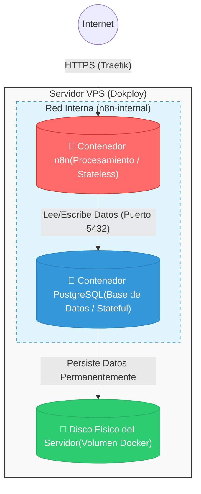

# n8n Deployment with Decoupled PostgreSQL Database

This repository contains a Docker Compose setup for deploying n8n with a decoupled PostgreSQL database. This architecture is designed for stability and data persistence, following best practices for microservices.

## 🧠 Part 1: Key Concepts ("Prosumer" Level)

To explain this to a friend, forget the hotel analogy. Let's talk about **Microservices Architecture**.

### 1. The Problem: "Stateless" Containers

By design, Docker containers (like the one she was using on Render) should be **ephemeral**. They are designed to be destroyed and recreated in seconds.

*   **The mistake:** Saving the database (SQLite) *inside* the container is like saving important documents in RAM. When you restart, the RAM is cleared.

### 2. The Solution: Decoupling of Services

The architecture proposed in `docker-compose.yml` separates responsibilities:

*   **Compute (n8n):** Processes the workflows. If it's deleted, nothing happens, another one just starts up.
*   **Storage (PostgreSQL):** Manages data transactionally and robustly.
*   **Persistence (Volumes):** It is the bridge between the virtual world of Docker and the physical disk of the server.

---

## 📊 Part 2: The Technical Diagram

This diagram visualizes the separated "boxes" of the architecture.



---

## 🛠️ Part 3: The Docker Compose (Commented Technical Version)

The `docker-compose.yml` file has comments focused on the **function** and not just the description. See the file for detailed comments on the services, networks, and volumes.

## Getting Started

1.  **Clone the repository:**
    ```bash
    git clone https://github.com/your-username/your-repo-name.git
    cd your-repo-name
    ```
2.  **Create a `.env` file:**
    Copy the `.env.example` file to `.env` and fill in the values for your environment.
    ```bash
    cp .env.example .env
    ```
3.  **Generate an encryption key:**
    ```bash
    openssl rand -base64 24
    ```
    Copy the output and paste it as the value for `N8N_ENCRYPTION_KEY` in your `.env` file.
4.  **Deploy the stack:**
    ```bash
    docker-compose up -d
    ```
