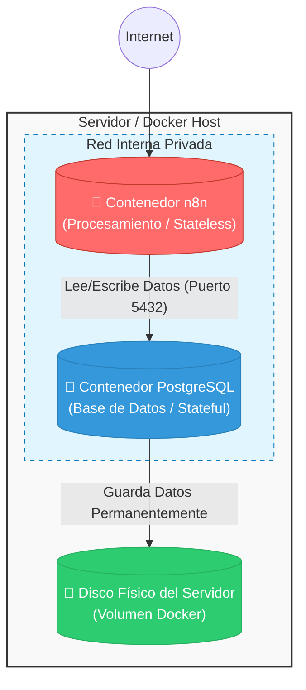

# Despliegue de n8n con Base de Datos PostgreSQL

Este repositorio contiene una configuración de **Docker Compose** para desplegar **n8n** conectándolo a una base de datos **PostgreSQL** externa.

Esta arquitectura está diseñada para solucionar el problema de la "pérdida de datos" común en despliegues simples, garantizando estabilidad, rendimiento y seguridad mediante la separación de responsabilidades.

-----

## 🧠 Conceptos Clave: ¿Por qué hacer esto?

Si vienes de usar n8n en servicios básicos o con su configuración por defecto, probablemente usabas **SQLite** (una base de datos que vive dentro de un archivo).

### 1\. El Problema: Contenedores "Sin Memoria" (Stateless)

Por diseño, los contenedores Docker deben ser **efímeros**. Están hechos para ser destruidos y recreados en segundos (por actualizaciones o errores).

  * **El error común:** Guardar la base de datos dentro del contenedor es como guardar documentos importantes en la memoria RAM de tu PC. Si reinicias, se borra todo.

### 2\. La Solución: Desacoplamiento de Servicios

Esta configuración separa el cerebro de la memoria:

  * **Cómputo (n8n):** Procesa los flujos de trabajo. Si este contenedor se borra, no pasa nada; se crea uno nuevo idéntico.
  * **Almacenamiento (PostgreSQL):** Una "caja fuerte" independiente que gestiona los datos de forma robusta.
  * **Persistencia (Volúmenes):** Es el puente entre el mundo virtual de Docker y el disco físico real de tu servidor, asegurando que los datos sobrevivan a cualquier reinicio.

-----

## 📊 Arquitectura del Sistema

El siguiente diagrama ilustra cómo se separan las "cajas" (servicios) para proteger tu información.



-----

## 🚀 Guía de Inicio Rápido

### Requisitos Previos

  * Docker y Docker Compose instalados en tu servidor.
  * Un dominio configurado apuntando a tu servidor (opcional, pero recomendado para webhooks).

### 1\. Clonar el repositorio

```bash
git clone https://github.com/tu-usuario/tu-repo.git
cd tu-repo
```

### 2\. Configurar variables de entorno

Copia el archivo de ejemplo para crear tu configuración real:

```bash
cp .env.example .env
```

Edita el archivo `.env` con tus datos. **Presta especial atención a la siguiente variable:**

> **⚠️ IMPORTANTE: `N8N_ENCRYPTION_KEY`**
> Esta clave se usa para cifrar tus credenciales (Google, Slack, AWS, etc.).
>
>   * Genera una clave segura y **guárdala en un gestor de contraseñas**.
>   * Si pierdes esta clave, perderás el acceso a todas las cuentas conectadas en n8n.

Puedes generar una clave segura ejecutando esto en tu terminal:

```bash
# Opción A (si tienes openssl)
openssl rand -base64 24

# Opción B (cualquier generador de contraseñas seguro funciona)
```

### 3\. Iniciar el servicio

Arranca los contenedores en segundo plano:

```bash
docker compose up -d
```

-----

## 🛠️ Mantenimiento

### Ver logs (para depuración)

Si algo falla, puedes ver qué está pasando dentro de los contenedores:

```bash
docker compose logs -f
```

### Actualizar n8n

Para obtener la última versión de n8n sin perder datos (gracias a esta arquitectura):

```bash
docker compose pull
docker compose up -d
```

### Copias de Seguridad (Backups)

Aunque Postgres es seguro, siempre es bueno tener un respaldo. Con esta configuración, solo necesitas respaldar el volumen llamado `postgres_data` o usar `pg_dump` desde fuera.

-----

## 🚀 Despliegue en Render

Si deseas desplegar n8n en Render.com, sigue estos pasos:

### 1. Crear Base de Datos PostgreSQL

1. Ve a tu dashboard de Render y selecciona **"New +"** → **"PostgreSQL"**
2. Dale un nombre (ejemplo: `n8n-database`)
3. Selecciona el plan Free o Starter según tus necesidades
4. Copia las credenciales de conexión (Internal Database URL)

### 2. Desplegar n8n como Web Service

1. Selecciona **"New +"** → **"Web Service"**
2. En "Docker", usa la imagen: `n8nio/n8n:latest`
3. Dale un nombre (ejemplo: `n8n-app`)

### 3. Configurar Variables de Entorno

En la sección de **Environment Variables**, agrega:

```env
DB_TYPE=postgresdb
DB_POSTGRESDB_HOST=[tu-host-de-render]
DB_POSTGRESDB_PORT=5432
DB_POSTGRESDB_DATABASE=[nombre-db]
DB_POSTGRESDB_USER=[usuario]
DB_POSTGRESDB_PASSWORD=[password]
N8N_ENCRYPTION_KEY=[genera-una-clave-segura]
N8N_HOST=[tu-dominio.onrender.com]
N8N_PORT=5678
N8N_PROTOCOL=https
WEBHOOK_URL=https://[tu-dominio.onrender.com]/
GENERIC_TIMEZONE=America/Mazatlan
NODE_ENV=production
```

> **⚠️ IMPORTANTE:** Genera `N8N_ENCRYPTION_KEY` con: `openssl rand -base64 32`
> 
> Si pierdes esta clave, perderás acceso a todas las credenciales guardadas en n8n.

### 4. Desplegar y Verificar

1. Haz clic en **"Create Web Service"**
2. Espera a que el servicio esté en estado **"Live"**
3. Accede a tu URL de Render y completa la configuración inicial de n8n
4. ¡Guarda tu `N8N_ENCRYPTION_KEY` en un lugar seguro!

-----

## 📂 Estructura de Archivos

  * `docker-compose.yml`: Define los servicios (n8n y Postgres) y cómo se conectan.
  * `.env`: Guarda tus secretos (contraseñas, usuarios, dominios). **Nunca subas este archivo a GitHub**.
  * `.env.example`: Plantilla para saber qué variables necesitas configurar.
  * `index.html`: Infografía web interactiva que visualiza esta arquitectura. [Ver en línea](https://adcondev.github.io/n8n-info/)

-----

## 🌐 Infografía Interactiva

Este repositorio incluye una **infografía web interactiva** que visualiza de forma atractiva toda la arquitectura descrita aquí.

**Ver la infografía:** [https://adcondev.github.io/n8n-info/](https://adcondev.github.io/n8n-info/)

La infografía incluye:
  * Diseño profesional en modo oscuro
  * Diagramas interactivos con Mermaid.js
  * Explicaciones visuales paso a paso
  * Código de ejemplo con estilo terminal
  * Totalmente responsive (móvil, tablet, desktop)
